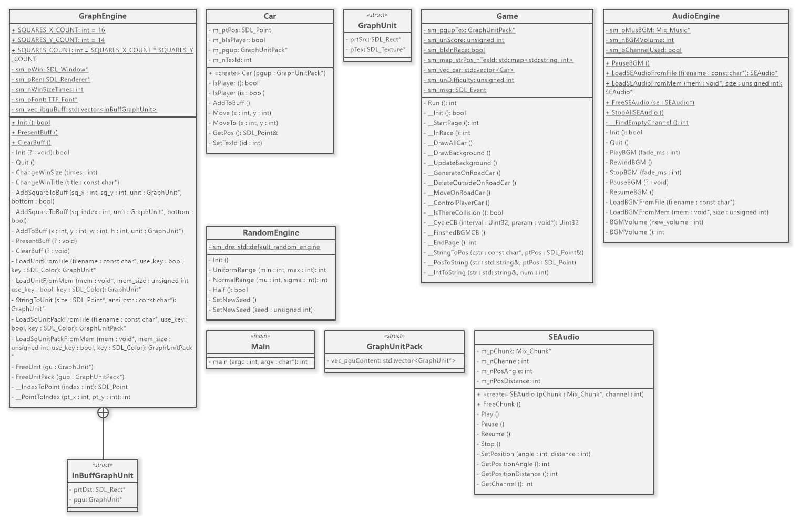

# Road-Fighter

## Objectives
* (a) Test the student’s ability to use OOP concepts.
* (b) Test the student’s ability work with external libraries.
* (c) Test the student’s ability to work in a team.

## UML of the pplicatin which is designed by Saliha Durrani

## Features
The main feature of the game is ride your car to end point and tackele all the obsticals.

## Learning Curves
We were aiming to learn and apply object oriented approach on SDL library, our main focus was to improve our abilities and come up with a solution that guage our abilities and polish it to the extends that help us in the future.

Google is a good place to find help, and we did allot of research and learn from different prebuild brojects and at the end we achieve something that will help us in future growth.

## Team Members
* (a)Saliha Durrani (Lead)
* (b)Aiman Jamil
* (c)Muhammad Noashir

A challanging team to work with, all have its strong points, it was difficult to distribute task among them, and we flowlessly did it.

Thenks to my team that we done it.

## Mentor
Dr. Muhammad Taj is an excelent monomentall personality, giving us the courage to face all the challenges head on, and Miss. Kiran for supportive role to give us the boast.

Thanks to all of them that we achive it.
